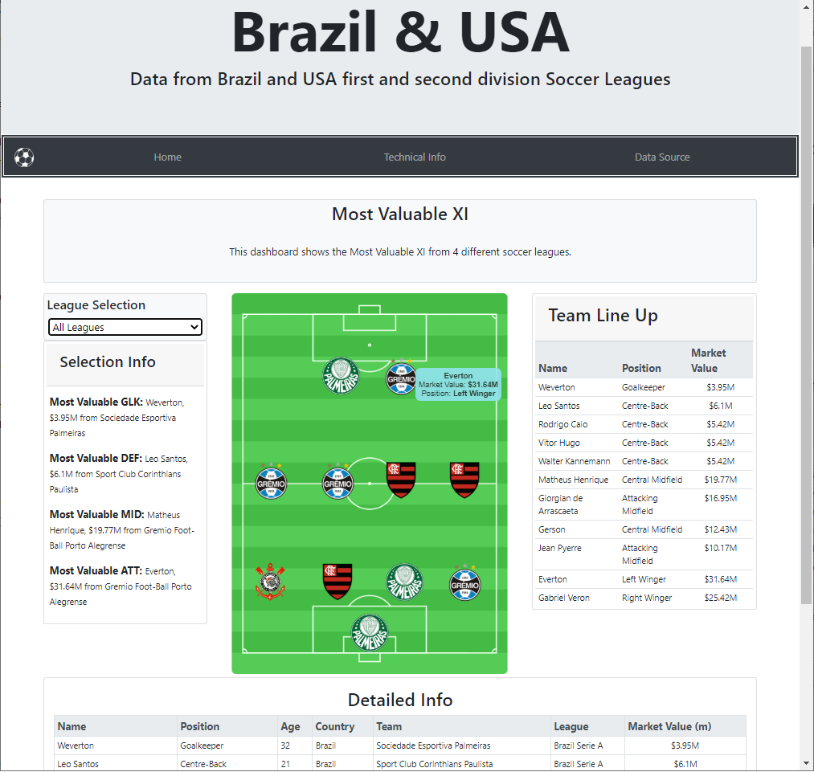

# Brazil & USA Soccer Leagues

For this project I build a web application that scrapes data from a webpage  displays the information in a single HTML page.

### Applied Technologies
* Python
* BeautifulSoup
* SQL (PostgreSQL)
* JSON
* HTML/CSS
* JavaScript
* D3

## Steps
* Step 1 - Scraping
   - Wesbsite scraped: [Transfermarkt](https://www.transfermarkt.us/) 
   - Using BeautifulSoup scrape the website and save the data in a .csv file.
 
* Step 2 - SQL and JSON
  - With SQLAlchemy to store all the data scraped from the URL above into in a single Database.
  - Create a JSON file with all the data and used it to build the dashboard. 

* Step 3 - HTML and JavaScript
  - Build a webpage to present the information.
  - Making use of JavaScript and D3 parse the JSON file and display the data. 
  
## Some Visualizations

